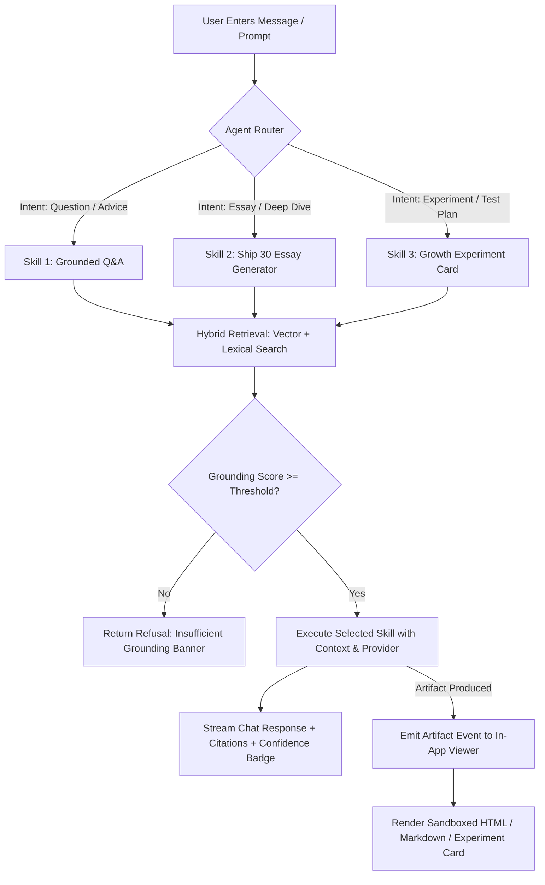

# Product Requirements Document (PRD)
# Project: The Lenny Growth Assistant
**Author:** Forward Deployed Engineering (FDE) Team  
**Status:** Approved / Ready for Architecture & Implementation  
**Target Delivery:** Full-Stack Web Application (Docker Compose + Local Ollama / Cloud LLM)

---

## 1. Executive Summary & Problem Statement

Product managers, founders, and growth operators frequently seek battle-tested advice on growth loops, monetization, product-market fit, user acquisition, retention, and team leadership. Lenny's Podcast and Newsletter archive (curated in [ChatPRD/lennys-podcast-transcripts](https://github.com/ChatPRD/lennys-podcast-transcripts)) represents one of the highest-density repositories of top-tier operator wisdom in the world.

However, general-purpose LLMs struggle with three critical problems when answering niche PM questions:
1. **Hallucination & Generic Advice:** Generic LLMs offer vague, conventional summaries rather than the tactical, contrarian, and specific frameworks shared by specific guests (e.g., Elena Verna on B2B product-led growth, Brian Balfour on growth loops, Shreyas Doshi on high-leverage PM habits).
2. **Lack of Attribution & Verifiability:** Operators need to verify source episodes, timestamps, guest identities, and specific quotes to trust high-stakes strategic recommendations.
3. **Actionability Gap:** Operators do not just want text answers; they need executable outputs—either structured growth experiment design cards ready to ship into Jira/Linear, or actionable thought-leadership essays adhering to proven publication frameworks (such as the Ship 30 for 30 methodology).

**The Lenny Growth Assistant** is an enterprise-grade, full-stack AI system that ingests the entire Lenny podcast transcript archive, indexes it for hybrid vector/lexical retrieval, and serves as an autonomous assistant equipped with specialized skills, an interactive live-rendering sandboxed artifact viewer, explicit grounding confidence indicators, and a dual local (Ollama) / cloud (Claude/OpenAI) execution engine.

---

## 2. Target Users & Personas

- **Primary Persona: The Growth PM / Growth Lead**
  - *Need:* Rapidly synthesize frameworks on acquisition loops, referral programs, pricing experiments, and conversion rate optimization (CRO) from proven industry leaders.
  - *Desired Output:* Structured Growth Experiment Cards with measurable target metrics, test plans, and risk assumptions that can be tested in 1-week sprints.
- **Secondary Persona: The Founder / Product Executive**
  - *Need:* Deep-dive strategic frameworks on 0-to-1 PMF, org design, hiring, and retention inflection points.
  - *Desired Output:* Ship 30 for 30-style synthesized executive essays (~1,250 words) with clean hooks, structured subheadings, and actionable takeaways for team distribution.
- **Tertiary Persona: The Technical Evaluator / Reviewer**
  - *Need:* Test the system locally using zero-cost, zero-API-key Ollama (e.g. `llama3.1:8b` or `qwen2.5:7b`), switch to cloud providers (Claude/OpenAI) on the fly, inspect explicit skill routing logs, verify iframe sandboxing security, and inspect end-to-end reliability when services fail.

---

## 3. Success Metrics & Key Performance Indicators (KPIs)

| Metric | Target | Verification Method |
|---|---|---|
| **Grounding Precision** | 100% of factual assertions backed by retrieved podcast chunk citations | Automated RAG evaluation & visible citation UI |
| **Hallucination Rejection Rate** | 100% refusal rate on out-of-domain queries (e.g., quantum physics, baking recipes) with explicit "Insufficient Grounding" banner | Out-of-domain query test suite |
| **Routing Accuracy** | >95% accurate skill dispatch between (1) Standard Q&A, (2) Ship 30 Essay, (3) Growth Experiment Card | Router unit tests with intent benchmark dataset |
| **Local Model Compatibility** | 100% functional on local Ollama (`llama3.1:8b` / `qwen2.5:7b`) without cloud API keys | Offline local Docker Compose smoke tests |
| **Artifact Rendering Latency** | <150ms sandbox mount and render upon generation | Client-side performance trace |
| **Security Isolation** | 0 script injection, 0 parent DOM access, 0 cookie access from untrusted LLM HTML | Sandboxed iframe CSP & penetration test suite |
| **Zero-Downtime Resilience** | Graceful degradation with clear user feedback when DB, Ollama, or API keys are disconnected | Chaos / fault-injection test scenarios |

---

## 4. Key Differentiators

### Differentiator 1: The Growth Experiment Card Generator (First-Class Skill)
A specialized autonomous skill triggered whenever a user asks to turn an insight, interview framework, or tactic into a testable growth initiative.
- **Structured Fields:**
  1. *Hypothesis:* Formulated strictly as `If we do [Action], then [Expected Outcome] will happen, because [Underlying Mechanism/Data]`.
  2. *Target Metric:* The single primary metric that moves (e.g., Day-7 activation rate, paid conversion rate, organic viral coefficient).
  3. *Test Plan:* A lean, step-by-step roadmap feasible to ship and measure within a 1-week sprint.
  4. *Risks & Invalidation Criteria:* Potential confounding factors or signals that prove the hypothesis false.
  5. *Expected Impact & Attribution:* Qualitative tier (High/Medium/Low) paired with exact episode and guest citation sources.
- **Distinct Visual Treatment:** Dedicated custom card renderer in the Artifact Viewer with export options (Copy Markdown, Export JSON, Download HTML).
- **Loggable Skill Boundaries:** Router logs provide exact reasoning explaining why the Experiment Card generator was invoked over general Q&A or Essay writing.

### Differentiator 2: Visual Grounding Confidence Indicator & Refusal Guardrail
Every assistant response computes a real-time grounding confidence score derived from retrieval density, similarity scores, and topic relevance.
- **States:**
  - `High Confidence` (>= 3 high-similarity relevant chunks): Green badge, full citations rendered.
  - `Medium Confidence` (1–2 moderate-similarity chunks): Yellow badge, contextual caution advised.
  - `Low Confidence` (weak lexical or marginal semantic match): Orange badge, highlighting uncertainty.
  - `Insufficient Grounding / Refusal` (< threshold): Red banner with clear explanation: *"I do not have enough material in Lenny's podcast archive to answer this question accurately."* Silently guessing or hallucinating is strictly prohibited.

---

## 5. Scope & Boundary Decisions

### In-Scope (Must-Have)
1. **Knowledge Ingestion & Indexing:** Ingest `ChatPRD/lennys-podcast-transcripts` (Markdown transcripts with metadata: Episode title, Guest, Publication Date, URL, full body text). Chunk with overlap, metadata enrichment, and store embeddings in pgvector / Postgres with fast lexical + vector retrieval.
2. **Dual-Provider Architecture:** Local Ollama support (default) + Anthropic Claude & OpenAI cloud support. Hot-switchable via UI dropdown and `.env` configuration.
3. **Three Core Skills with Routing Engine:**
   - Skill 1: *Grounded Q&A Agent* with citations and confidence metrics.
   - Skill 2: *Ship 30 for 30 Essay Generator* (~1,250 words, Hook, 1-3-1 structure, skimmable bullet points, concrete takeaways).
   - Skill 3: *Growth Experiment Card Generator* (Hypothesis, Metric, 1-Week Test Plan, Risks, Impact).
4. **Interactive In-App Artifact Viewer:**
   - Multi-tab rendering (Live Preview vs. Raw Source).
   - Dedicated renderers for: (a) Sandboxed HTML/CSS, (b) Markdown, (c) Growth Experiment Cards.
   - Strict `iframe` sandboxing (`sandbox="allow-scripts"` without `allow-same-origin`, strict Content-Security-Policy).
   - One-click Copy, Download, and Fullscreen modes.
5. **Persistence Layer:** PostgreSQL (Supabase compatible) via asyncpg / SQLAlchemy storing sessions, message history, retrieved context IDs, artifact versions, and feedback.
6. **Robust Error Handling:** Clear UI notifications on missing keys, model timeouts, Ollama offline state, or database connection errors without crashing.
7. **One-Command Deployment:** Docker Compose orchestration for Web Frontend, FastAPI Backend, and PostgreSQL database.

### Out-of-Scope (Explicitly Cut to Prevent Scope Creep)
1. *Audio Transcription Pipeline (Whisper):* Transcripts are already provided as text in the repository. We do not re-run raw audio transcription.
2. *Complex Multi-Tenant User Authentication (OAuth/SAML):* Focus is on clean session-based persistence and evaluation simplicity.
3. *Arbitrary Web Search Integration:* The assistant is strictly bounded to Lenny's podcast transcript knowledge base.

---

## 6. System Assumptions & Technical Decisions

1. **Transcript Source Format:** Transcripts in `ChatPRD/lennys-podcast-transcripts` are Markdown/text files containing guest names, episode numbers/titles, and dialogue text.
2. **Embedding Model Selection:** Default to lightweight, fast embeddings (`all-MiniLM-L6-v2` or `nomic-embed-text` via Ollama/sentence-transformers) running locally with pgvector cosine distance, with optional OpenAI/Voyage embeddings when cloud keys are provided.
3. **Local LLM Model Default:** `llama3.1:8b` or `qwen2.5:7b` on Ollama (`http://localhost:11434` or Docker host).
4. **Cloud LLM Models:** `claude-3-5-sonnet` (Anthropic) and `gpt-4o` / `gpt-4o-mini` (OpenAI).
5. **Database Strategy:** Standard PostgreSQL with `pgvector` extension enabled, accessible via standard async connection string (`postgresql+asyncpg://...`). Compatible with local Docker PostgreSQL and Supabase hosted PostgreSQL.
6. **Frontend Framework:** React + Vite + Tailwind CSS + Lucide Icons + custom Sandboxed Artifact Container.

---

## 7. User Flows & Interaction Model

---

## 8. Functional Requirements & Acceptance Criteria

### FR-1: Session Management & Persistence
- **AC 1.1:** User can click "New Chat" to spin up an isolated session ID with fresh conversational context.
- **AC 1.2:** Chat history, system messages, retrieved sources, and generated artifacts persist across page refreshes in PostgreSQL.
- **AC 1.3:** Session sidebar lists previous conversations with timestamp and dynamic summary title.

### FR-2: Retrieval Augmented Generation (RAG) & Citations
- **AC 2.1:** Ingestion script chunks transcripts (~500–800 tokens with 15% overlap) while preserving speaker context and episode metadata.
- **AC 2.2:** Every retrieved chunk includes Episode Title, Guest Name, Episode Link/ID, and matched text snippet.
- **AC 2.3:** Assistant answers must include clickable or expand-to-inspect citation badges linked to exact transcript references.

### FR-3: Grounding Confidence & Refusal Mechanism
- **AC 3.1:** Assistant computes a confidence score (High/Med/Low/Insufficient) based on semantic distance and retrieval density.
- **AC 3.2:** If confidence is "Insufficient" (< 0.55 similarity or 0 relevant chunks), the model returns a standardized honest refusal and does not fabricate answers.

### FR-4: Skill 2 — Ship 30 for 30 Essay Generator
- **AC 4.1:** Generates a comprehensive ~1,000–1,250 word publication-ready essay.
- **AC 4.2:** Follows core Ship 30 principles:
  - Strong, curiosity-driven Headline/Hook.
  - 1-3-1 Rhythm / short skimmable paragraphs.
  - 3–5 core thematic sections with bold takeaways.
  - Concluding summary with an actionable next step.
- **AC 4.3:** Automatically opens in the Artifact Viewer as an interactive Markdown / Rich Text preview.

### FR-5: Skill 3 — Growth Experiment Card Generator
- **AC 5.1:** Detects user intent ("turn this into an experiment", "how do we test this?", "give me a test plan").
- **AC 5.2:** Generates structured Experiment Card with:
  - Hypothesis (`If [X] then [Y] because [Z]`)
  - Target Metric
  - 1-Week Test Plan (Step 1-4)
  - Risks & Invalidation Triggers
  - Expected Impact & Source Attribution
- **AC 5.3:** Automatically opens in the Artifact Viewer with custom interactive experiment card styling, metrics highlight, and JSON/Markdown export.

### FR-6: Security & Untrusted Artifact Sandboxing
- **AC 6.1:** All generated HTML/CSS artifacts are rendered inside an isolated `<iframe>` with strict `sandbox="allow-scripts"` (strictly NO `allow-same-origin`).
- **AC 6.2:** Parent cookies, localStorage, session tokens, and DOM trees are completely inaccessible to the iframe.
- **AC 6.3:** Content-Security-Policy (CSP) headers restrict script origins and prevent arbitrary external resource exfiltration.

### FR-7: Multi-Provider LLM Switcher
- **AC 7.1:** User can switch active provider (Ollama Local, Anthropic Claude, OpenAI) via UI dropdown in real time or via environment variables (`LLM_PROVIDER`).
- **AC 7.2:** If an API key is missing or Ollama is offline, system returns a helpful inline UI banner rather than an unhandled 500 error.

---

## 9. Non-Functional Requirements & Security
- **Response Latency:** Initial chunk stream start < 1.2s on cloud models, < 2.5s on local Ollama.
- **Portability:** App must launch with a single `docker compose up --build` command.
- **Observability:** Structured JSON logging for API requests, retrieval scores, routing decisions, and LLM token usage.

---

## 10. Implementation Plan & Milestones

1. **Step 1: PRD (This Document)** — Baseline product requirements, criteria, scope, and user flows.
2. **Step 2: Architecture Specification (`architecture.md`)** — Detailed DB schemas, REST API specs, component diagrams, security model, and routing architecture.
3. **Step 3: Backend Core & Database Persistence** — FastAPI server, PostgreSQL schema, asyncpg session manager, health check, and error handlers.
4. **Step 4: Ingestion & Hybrid RAG Engine** — Transcript loader, chunker, vector/lexical embeddings indexer, similarity ranker, and confidence scorer.
5. **Step 5: Agent Router & 3 First-Class Skills** — Skill 1 (Grounded Q&A), Skill 2 (Ship 30 Essay), Skill 3 (Growth Experiment Card) with audit-loggable routing.
6. **Step 6: Frontend & Sandboxed Artifact Viewer** — Modern React/Vite UI with chat interface, citation drawer, confidence pills, model switcher, and sandboxed iframe viewer.
7. **Step 7: Deployment & Operational Readiness** — Dockerfile, Docker Compose, `.env.example`, health checks, and fallback mechanisms.
8. **Step 8: UI/UX Design Specification (`design.md`)** — Design tokens, typography, visual hierarchy, responsive layout, and accessibility rules.
9. **Step 9: Automated & Manual Testing Suite** — Backend pytest suite (API, RAG, Routing, Persistence), security sandbox tests, and manual verification script.
10. **Step 10: Master README & Documentation** — Complete installation guide, local Ollama walkthrough, cloud setup, API reference, and troubleshooting guide.
11. **Step 11: Self-Review & Verification Checklist** — Rigorous verification against all client rubric items.
