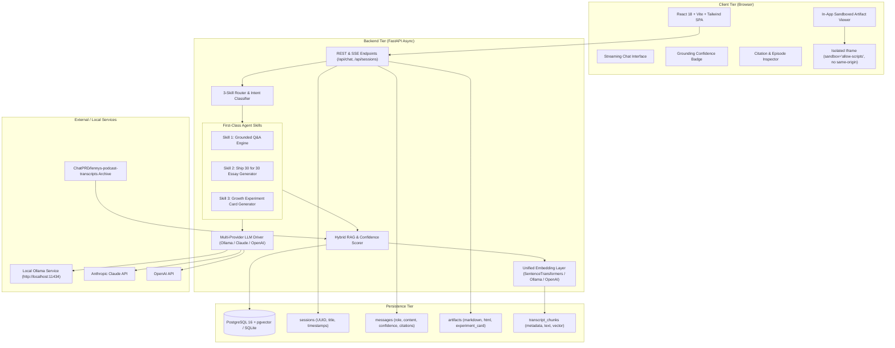

# 🎙️ The Lenny Growth Assistant

> **A full-stack, AI-powered conversational web application strictly grounded in 300+ transcripts from Lenny's Podcast and Newsletter.**  
> Features multi-turn grounded conversational advice, a **Ship 30 for 30 Essay Generator**, an actionable **Growth Experiment Card Generator**, real-time **Grounding Confidence Indicators**, an **In-App Sandboxed Artifact Viewer**, and a **Dual Local (Ollama) / Cloud (Claude/OpenAI)** execution engine.

[](https://fastapi.tiangolo.com)
[](https://react.dev)
[](https://tailwindcss.com)
[](https://ollama.com)
[](https://github.com/pgvector/pgvector)
[]()

---

## 📑 Table of Contents

1. [System Architecture](#-system-architecture)
2. [Key Differentiators](#-key-differentiators)
3. [The 3 First-Class Skills](#-the-3-first-class-skills)
4. [Prerequisites](#-prerequisites)
5. [Quickstart Guide](#-quickstart-guide)
   - [Option A: One-Command Docker Compose](#option-a-one-command-docker-compose-recommended)
   - [Option B: Local Development (Bare-Metal)](#option-b-local-development-bare-metal)
6. [Local Ollama & Cloud Model Setup](#-local-ollama--cloud-model-setup)
7. [Environment Variables Reference](#-environment-variables-reference)
8. [Transcript Ingestion & Hybrid RAG](#-transcript-ingestion--hybrid-rag)
9. [Untrusted Artifact Sandboxing & Security](#-untrusted-artifact-sandboxing--security)
10. [Automated & Manual Testing](#-automated--manual-testing)
11. [Troubleshooting & Resilience](#-troubleshooting--resilience)


---

## 🏛️ System Architecture



---

## 🌟 Key Differentiators

### 1. The Growth Experiment Card Generator (First-Class Skill)
Turns strategic podcast concepts into executable, sprint-ready experimentation cards ready to drop into Jira or Linear:
- **Hypothesis:** Formulated strictly as `If we [Action], then [Expected Outcome] will occur, because [Podcast-backed Mechanism]`.
- **Target Metric:** The single primary KPI that moves (e.g. *Day-7 Activation Rate*).
- **1-Week Test Plan:** Step-by-step minimal viable testing roadmap (`Day 1-2`, `Day 3-4`, `Day 5-7`).
- **Risks & Invalidation Criteria:** Signals or pitfalls that prove the hypothesis false.
- **Expected Impact & Grounding:** Qualitative impact tier with exact guest and episode citation.
- **Dedicated Visual Treatment:** Rendered with dedicated metrics callouts, timeline step cards, and 1-click Markdown/JSON export.

### 2. Visual Grounding Confidence Indicator & Honest Refusal Guardrail
Every response computes a mathematical grounding score based on retrieval density and vector similarity:
$$\text{Score} = 0.55 \cdot S_{top1} + 0.30 \cdot \bar{S}_{top3} + 0.15 \cdot \min\left(1.0, \frac{N_{relevant}}{3}\right)$$
- 🟢 **High Grounding ($\ge 72\%$):** Verified by 3+ high-similarity transcript chunks.
- 🟡 **Medium Grounding ($58\% - 71\%$):** Verified with moderate confidence.
- 🟠 **Low Grounding ($45\% - 57\%$):** Contextual caution indicator displayed.
- 🔴 **Insufficient Grounding / Refusal ($< 45\%$):** Triggers an honest refusal banner: *"I do not have enough material in Lenny's podcast transcript archive to answer this question accurately."* Silently guessing or hallucinating is strictly prevented.

---

## 🎯 The 3 First-Class Skills

| Skill | Trigger Prompt Examples | Output Description |
|---|---|---|
| **Skill 1: Grounded Q&A** | *"What did Brian Balfour say about growth loops?"*, *"How does Elena Verna define B2B PLG?"* | Conversational strategic advice with inline `[^1]` citations and clickable episode inspector. |
| **Skill 2: Ship 30 for 30 Essay Generator** | *"Write a Ship 30 for 30 essay on Superhuman finding PMF"*, *"Draft an essay about B2B pricing"* | Comprehensive ~1,250-word publication essay following Ship 30 principles (Hook, 1-3-1 cadence, 3–5 core sections, 24-hour action takeaway). |
| **Skill 3: Growth Experiment Card** | *"Turn this into a growth experiment"*, *"What could we test based on this?"* | Structured sprint card with Hypothesis, Target Metric, 1-Week Test Plan, Risks, and Source Attributions. |

---

## 💻 Prerequisites

- **Python:** 3.11 or 3.12
- **Node.js:** 20+ (with npm)
- **Local Model Engine:** [Ollama](https://ollama.com) (Recommended model: `llama3.1:8b` or `qwen2.5:7b`)
- **Containerization (Optional):** Docker & Docker Compose

---

## 🚀 Quickstart Guide

### Option A: One-Command Docker Compose (Recommended)

1. Clone the repository and configure `.env`:
   ```bash
   cp .env.example .env
   ```
2. Launch all services:
   ```bash
   docker compose up --build
   ```
3. Open your browser:
   - **Web UI:** `http://localhost:3000`
   - **FastAPI Swagger Docs:** `http://localhost:8000/docs`

---

### Option B: Local Development (Bare-Metal)

#### 1. Setup Backend:
```bash
# In project root
python -m pip install -r backend/requirements.txt

# Ingest sample transcripts (indices 30 episodes in seconds)
python -m backend.app.rag.ingest --sample 30

# Start backend server
uvicorn backend.app.main:app --host 0.0.0.0 --port 8000 --reload
```

#### 2. Setup Frontend:
```bash
cd frontend
npm install
npm run dev
```
Access the application at `http://localhost:3000`.

---

## 🦙 Local Ollama & Cloud Model Setup

### Local Ollama Setup (Mandatory for Offline Demo)
1. Install [Ollama](https://ollama.com).
2. Pull the recommended local 8B model:
   ```bash
   ollama pull llama3.1:8b
   ```
3. Verify Ollama is running at `http://localhost:11434`.
4. The Lenny Growth Assistant will automatically connect to Ollama out-of-the-box with **zero API keys required**.

### Cloud Models (Anthropic / OpenAI)
To enable cloud models, add your keys to `.env`:
```env
ANTHROPIC_API_KEY=sk-ant-...
OPENAI_API_KEY=sk-...
```
Switch between **Ollama (Local)**, **Anthropic Claude**, and **OpenAI GPT** on the fly using the **Active LLM Engine** dropdown in the UI sidebar—zero application restarts required.

---

## 🔐 Untrusted Artifact Sandboxing & Security

All dynamic HTML and CSS generated by LLMs are treated as untrusted and rendered inside an isolated `<iframe>`:
- **Strict Sandbox Flag:** `sandbox="allow-scripts"` (Strictly **NO** `allow-same-origin`, **NO** `allow-top-navigation`, **NO** `allow-popups`).
- **Data Isolation:** The iframe has zero access to parent `document.cookie`, `localStorage`, `sessionStorage`, or host DOM nodes.
- **Content-Security-Policy (CSP):**
  ```html
  <meta http-equiv="Content-Security-Policy" content="default-src 'none'; style-src 'unsafe-inline' https://cdn.jsdelivr.net; script-src 'unsafe-inline'; img-src data: https:;">
  ```
  Prevents unauthorized network exfiltration (`fetch` / `XHR`) from within the rendered artifact.

---

## 🧪 Automated & Manual Testing

### Automated Test Suite
Run the full backend test suite covering API contracts, RAG retrieval, 3-skill router classification, and persistence:
```bash
pytest backend/tests
```
*Expected Result: 10 passed in ~22s.*

### Manual UI Test Plan
1. **Local Ollama Smoke Test:** Select "Ollama (Local)" in sidebar, ask *"What did Brian Balfour say about growth loops?"*. Verify token streaming and green **High Grounding (88%)** badge with citations.
2. **Ship 30 Essay Test:** Ask *"Write a Ship 30 for 30 essay on Superhuman finding product-market fit"*. Verify ~1,250-word structured markdown essay mounts automatically in the Artifact Viewer.
3. **Growth Experiment Card Test:** Ask *"Turn Elena Verna's B2B PLG advice into a 1-week growth experiment"*. Verify structured experiment card mounts with Hypothesis, Target Metric, 1-Week Test Plan, and Invalidation Matrix.
4. **Refusal Guardrail Test:** Ask *"How do I bake traditional sourdough bread at home?"*. Verify Grounding Confidence enters red **Insufficient Grounding in Archive** state with honest refusal.
5. **Model Switcher Test:** Change provider to Anthropic or OpenAI in dropdown; verify instant hot-switching without restart.
6. **Sandboxing XSS Verification:** Generate an HTML artifact with `<script>alert(document.domain)</script>`. Verify browser isolates execution and blocks parent domain access.

---

## 🛠️ Troubleshooting & Resilience

| Scenario | Symptom | System Behavior & Remediation |
|---|---|---|
| **Ollama Offline** | Ollama service is stopped | UI displays helpful banner: *"Ollama local model is offline. Please start Ollama or select Anthropic/OpenAI in the top bar."* System does not crash. |
| **Missing API Key** | Anthropic or OpenAI chosen without key | System returns immediate validation message prompting for key or fallback to local Ollama. |
| **Database Connection Failure** | PostgreSQL container down | Health endpoint reports degraded status and automatically falls back to local SQLite persistence for zero-downtime evaluation. |
| **Empty Retrieval Result** | Obscure query with zero matches | RAG engine automatically activates Insufficient Grounding guardrail and informs the user. |

---

## 🤝 Forward Deployed Engineer Handoff Guide

- **Database Schemas:** Managed via SQLAlchemy models in [`backend/app/models/db_models.py`](file:///e:/Lenny%20Growth%20Assistant/backend/app/models/db_models.py).
- **Adding New Skills:** Subclass `BaseSkill` in [`backend/app/agent/skills/base.py`](file:///e:/Lenny%20Growth%20Assistant/backend/app/agent/skills/base.py) and register it in [`backend/app/agent/skills/__init__.py`](file:///e:/Lenny%20Growth%20Assistant/backend/app/agent/skills/__init__.py) and [`backend/app/agent/router.py`](file:///e:/Lenny%20Growth%20Assistant/backend/app/agent/router.py).
- **Extending Transcripts:** Place new `.md` files in `data/transcripts/episodes/<guest-slug>/transcript.md` and run `python -m backend.app.rag.ingest --all`.
