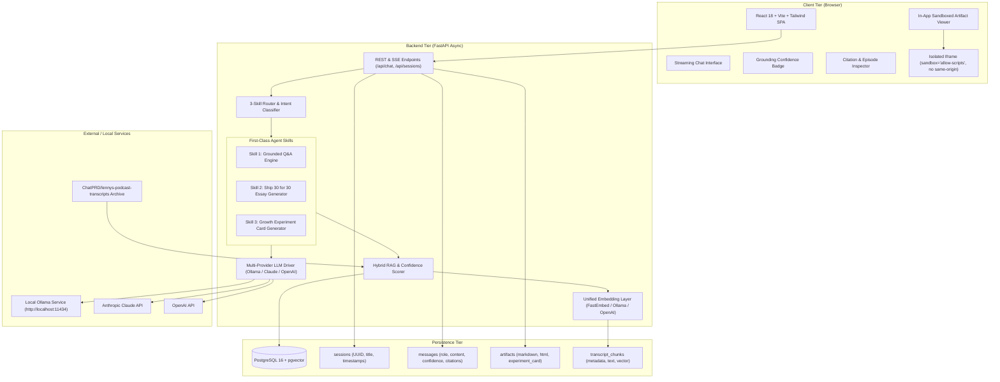
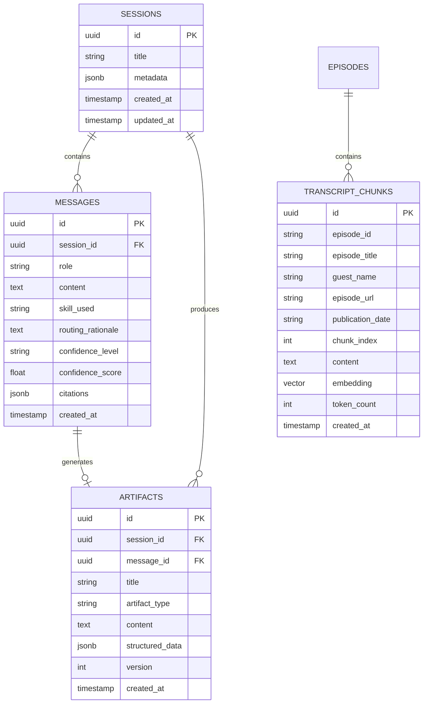
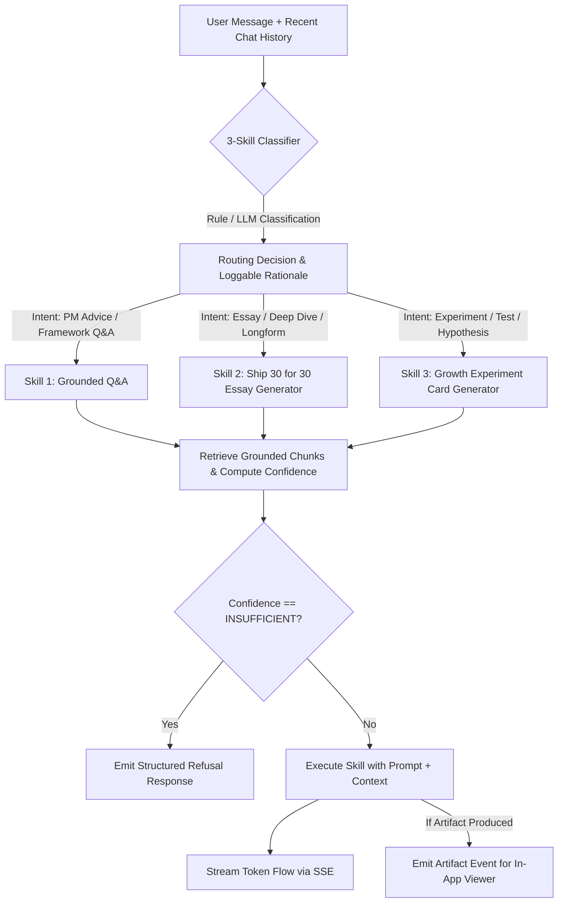
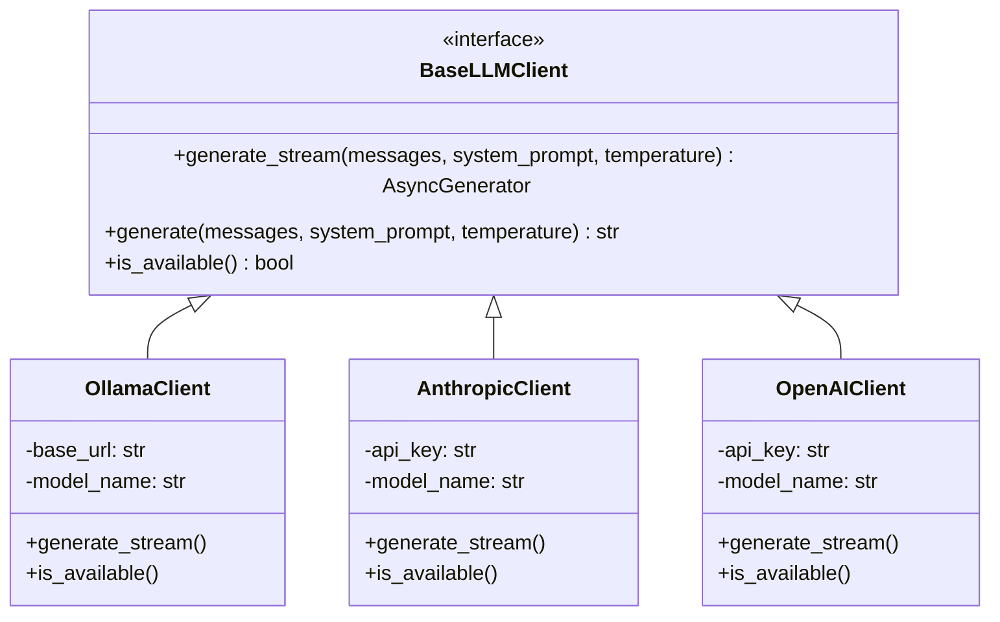
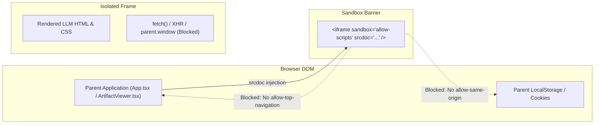

# Architecture Specification (`architecture.md`)
# Project: The Lenny Growth Assistant
**Author:** Forward Deployed Engineering (FDE) Team  
**Status:** Approved for Implementation

---

## 1. System Overview & Component Topology



---

## 2. Database Schema (PostgreSQL with pgvector)

The database runs on PostgreSQL 16 with the `pgvector` extension enabled. It uses SQLAlchemy 2.0 async ORM with `asyncpg`.

### 2.1 Entity Relationship Diagram



### 2.2 SQL DDL Schema

```sql
-- Enable vector extension
CREATE EXTENSION IF NOT EXISTS vector;
CREATE EXTENSION IF NOT EXISTS "uuid-ossp";

-- Sessions Table
CREATE TABLE IF NOT EXISTS sessions (
    id UUID PRIMARY KEY DEFAULT uuid_generate_v4(),
    title VARCHAR(255) NOT NULL DEFAULT 'New Conversation',
    metadata JSONB DEFAULT '{}'::jsonb,
    created_at TIMESTAMP WITH TIME ZONE DEFAULT CURRENT_TIMESTAMP,
    updated_at TIMESTAMP WITH TIME ZONE DEFAULT CURRENT_TIMESTAMP
);

-- Messages Table
CREATE TABLE IF NOT EXISTS messages (
    id UUID PRIMARY KEY DEFAULT uuid_generate_v4(),
    session_id UUID NOT NULL REFERENCES sessions(id) ON DELETE CASCADE,
    role VARCHAR(32) NOT NULL, -- 'user', 'assistant', 'system'
    content TEXT NOT NULL,
    skill_used VARCHAR(64), -- 'grounded_qa', 'ship30_essay', 'growth_experiment'
    routing_rationale TEXT,
    confidence_level VARCHAR(32), -- 'HIGH', 'MEDIUM', 'LOW', 'INSUFFICIENT'
    confidence_score FLOAT,
    citations JSONB DEFAULT '[]'::jsonb,
    created_at TIMESTAMP WITH TIME ZONE DEFAULT CURRENT_TIMESTAMP
);

CREATE INDEX IF NOT EXISTS idx_messages_session_id ON messages(session_id);

-- Artifacts Table
CREATE TABLE IF NOT EXISTS artifacts (
    id UUID PRIMARY KEY DEFAULT uuid_generate_v4(),
    session_id UUID NOT NULL REFERENCES sessions(id) ON DELETE CASCADE,
    message_id UUID REFERENCES messages(id) ON DELETE SET NULL,
    title VARCHAR(255) NOT NULL,
    artifact_type VARCHAR(64) NOT NULL, -- 'markdown', 'html', 'growth_experiment'
    content TEXT NOT NULL,
    structured_data JSONB DEFAULT '{}'::jsonb,
    version INT DEFAULT 1,
    created_at TIMESTAMP WITH TIME ZONE DEFAULT CURRENT_TIMESTAMP
);

CREATE INDEX IF NOT EXISTS idx_artifacts_session_id ON artifacts(session_id);

-- Transcript Chunks Table
CREATE TABLE IF NOT EXISTS transcript_chunks (
    id UUID PRIMARY KEY DEFAULT uuid_generate_v4(),
    episode_id VARCHAR(128) NOT NULL,
    episode_title VARCHAR(512) NOT NULL,
    guest_name VARCHAR(255) NOT NULL,
    episode_url TEXT,
    publication_date VARCHAR(64),
    chunk_index INT NOT NULL,
    content TEXT NOT NULL,
    embedding vector(384), -- 384 for all-MiniLM-L6-v2 / nomic-embed-text
    token_count INT,
    created_at TIMESTAMP WITH TIME ZONE DEFAULT CURRENT_TIMESTAMP
);

CREATE INDEX IF NOT EXISTS idx_transcript_chunks_episode ON transcript_chunks(episode_id);
-- HNSW Index for ultra-fast vector similarity search
CREATE INDEX IF NOT EXISTS idx_transcript_chunks_embedding ON transcript_chunks USING hnsw (embedding vector_cosine_ops);
-- Full-Text search index for hybrid retrieval
CREATE INDEX IF NOT EXISTS idx_transcript_chunks_fts ON transcript_chunks USING gin(to_tsvector('english', content));
```

---

## 3. Ingestion & Hybrid RAG Engine

### 3.1 Chunking & Metadata Enrichment
- **Source Files:** Markdown transcripts from `ChatPRD/lennys-podcast-transcripts`.
- **Chunk Size:** Sliding window of 500–700 tokens with 15% overlap.
- **Header Propagation:** Each chunk inherits frontmatter metadata:
  - Episode Title (e.g. *"Brian Balfour on Growth Loops and Retention"*)
  - Guest Name (e.g. *"Brian Balfour"*)
  - YouTube / Podcast URL
  - Chunk ID format: `[EpisodeSlug]__chunk_[Index]`

### 3.2 Embedding Generation Layer
- **Default Local Embedding:** FastEmbed / sentence-transformers `all-MiniLM-L6-v2` (384 dimensions, zero external API required, executes in CPU/GPU in milliseconds).
- **Alternative:** Ollama `nomic-embed-text` or OpenAI `text-embedding-3-small`.

### 3.3 Hybrid Retrieval & Grounding Confidence Scoring
Given user query $Q$, the RAG engine performs hybrid retrieval:
1. **Dense Vector Search:** Cosine similarity via `pgvector` (`1 - (embedding <=> query_vec)`).
2. **Sparse Lexical Search:** PostgreSQL `ts_rank_cd(to_tsvector('english', content), plainto_tsquery('english', query))`.
3. **Combined Reciprocal Rank Fusion (RRF):**
   $$RRF\_Score(d) = \frac{0.7}{60 + Rank_{vec}(d)} + \frac{0.3}{60 + Rank_{lex}(d)}$$

### 3.4 Grounding Confidence Indicator Algorithm
The Grounding Confidence Indicator computes a quantitative metric based on retrieved chunks:
$$\text{Score} = 0.55 \cdot S_{top1} + 0.30 \cdot \bar{S}_{top3} + 0.15 \cdot \min\left(1.0, \frac{N_{relevant}}{3}\right)$$
Where $S$ represents cosine similarity normalized to $[0, 1]$, and $N_{relevant}$ is the count of chunks with $S \ge 0.55$.

| Score Range | Grounding Level | UI Representation | System Action |
|---|---|---|---|
| **$\ge 0.72$** | **HIGH** | Green Badge + Citation Pill | Full execution with high confidence |
| **$0.58 \le \text{Score} < 0.72$** | **MEDIUM** | Yellow Badge + Citation Pill | Full execution with standard grounding |
| **$0.45 \le \text{Score} < 0.58$** | **LOW** | Orange Badge + Caution Pill | Full execution with caveat indicator |
| **$< 0.45$** | **INSUFFICIENT** | Red Banner ("Insufficient Grounding") | **Hard Refusal Guardrail:** Refuses to guess or hallucinate; informs user that Lenny's podcast does not cover this topic. |

---

## 4. Agent Routing & The 3 First-Class Skills



### 4.1 Skill 1: Grounded Conversational Q&A
- **Objective:** Answer strategic product and growth questions strictly grounded in podcast transcripts.
- **Constraints:**
  - Quote guests verbatim when highlighting key metrics or frameworks.
  - Provide inline citation tokens `[^1]`, `[^2]` linked to the retrieved chunk metadata.
  - If a detail is missing, state clearly that it was not discussed in the episode.

### 4.2 Skill 2: Ship 30 for 30 Essay Generator
- **Objective:** Transform podcast insights into a ~1,250-word, high-engagement, structured thought-leadership essay.
- **Framework Encoded:**
  1. **The Hook:** Curiosity + Clear Promise in the first 2 lines.
  2. **1-3-1 Rhythm:** Alternate single sentence punches with 3-sentence explanatory paragraphs.
  3. **3–5 Clear Subheadings:** Skimmable, benefit-driven headers.
  4. **Actionable Takeaways & Quotes:** Direct guest attributions.
  5. **The Conclusion:** A memorable closing punchline and a 24-hour action step.
- **Output:** Emits a `markdown` artifact automatically mounted in the Artifact Viewer.

### 4.3 Skill 3: Growth Experiment Card Generator (Differentiator)
- **Objective:** Transform strategic concepts into an executable, sprint-ready experimentation card.
- **Structured Schema:**
  ```json
  {
    "experiment_title": "string",
    "hypothesis": "If we [Action], then [Outcome] will occur because [Transcript-backed Mechanism].",
    "target_metric": "Primary metric (e.g. Day-7 Activation Rate)",
    "secondary_metrics": ["Guardrail metric 1", "Guardrail metric 2"],
    "one_week_test_plan": [
      {"day": "Day 1-2", "step": "Instrumentation & baseline measurement"},
      {"day": "Day 3-4", "step": "Deploy minimal variant (50/50 traffic split)"},
      {"day": "Day 5-7", "step": "Evaluate significance & kill/scale decision"}
    ],
    "risks_and_invalidation": [
      "Confounding seasonal traffic changes",
      "High drop-off at step 2 invalidates mechanism"
    ],
    "expected_impact": "High / Medium / Low",
    "grounding_source": {
      "guest": "Elena Verna",
      "episode": "B2B PLG and Growth Loops",
      "quote": "..."
    }
  }
  ```
- **Output:** Emits a `growth_experiment` artifact rendered with a custom interactive UI (metrics pill, test schedule timeline, risk matrix, copyable Markdown/JSON).

---

## 5. Multi-Provider LLM Engine

The system features a decoupled provider interface with zero application restarts needed to switch models:



### Provider Fallback & Graceful Degradation:
1. **Default:** Local Ollama (`llama3.1:8b` or `qwen2.5:7b`).
2. **If Ollama is unreachable:** Returns clear HTTP/SSE event: `"Ollama local model is offline. Please start Ollama or select Anthropic/OpenAI in the top bar."`
3. **If Cloud API Key is missing:** Returns immediate warning banner in UI prompting user to set key or use local Ollama.

---

## 6. Security Model & Untrusted Artifact Sandboxing



### 6.1 Strict Sandboxing Rules:
- **Iframe Attributes:** `sandbox="allow-scripts"` (strictly **NO** `allow-same-origin`, **NO** `allow-top-navigation`, **NO** `allow-modals`, **NO** `allow-popups`).
- **Isolation Guarantees:**
  - `window.parent` and `window.top` access are blocked by browser cross-origin policy.
  - `document.cookie` is empty and inaccessible.
  - `localStorage` and `sessionStorage` in the iframe are segregated from the parent host origin.
- **Content Security Policy (CSP):** The iframe injected HTML includes:
  ```html
  <meta http-equiv="Content-Security-Policy" content="default-src 'none'; style-src 'unsafe-inline' https://cdn.jsdelivr.net; script-src 'unsafe-inline'; img-src data: https:;">
  ```

---

## 7. REST & SSE API Contract

| Method | Endpoint | Description | Request Body / Params |
|---|---|---|---|
| `GET` | `/api/health` | Service health (DB status, Ollama status, provider configs) | None |
| `GET` | `/api/providers` | List available LLM providers and active model | None |
| `POST` | `/api/providers/select` | Set active provider (`ollama`, `anthropic`, `openai`) | `{"provider": "ollama", "model": "llama3.1:8b"}` |
| `GET` | `/api/sessions` | List all conversation sessions | None |
| `POST` | `/api/sessions` | Create a new session | `{"title": "Optional Title"}` |
| `GET` | `/api/sessions/{id}` | Get session details + message history | Path param `id` |
| `DELETE` | `/api/sessions/{id}` | Delete a session and its artifacts | Path param `id` |
| `POST` | `/api/chat` | Main streaming chat endpoint (Server-Sent Events) | `{"session_id": "UUID", "message": "...", "provider": "..."}` |
| `GET` | `/api/artifacts/{id}` | Retrieve specific artifact by ID | Path param `id` |
| `POST` | `/api/ingest/sync` | Trigger transcript indexing / sample ingestion | `{"sample_size": 25}` |

---

## 8. Deployment Topology

The application runs in a containerized environment via Docker Compose:
- **`postgres` Container:** PostgreSQL 16 + pgvector on port `5432`.
- **`backend` Container:** Python 3.11 + FastAPI + Uvicorn on port `8000`.
- **`frontend` Container:** Node 20 / Nginx serving built SPA on port `3000`.
- **Host / Local Network:** Connects to Ollama on `host.docker.internal:11434` or local host.
